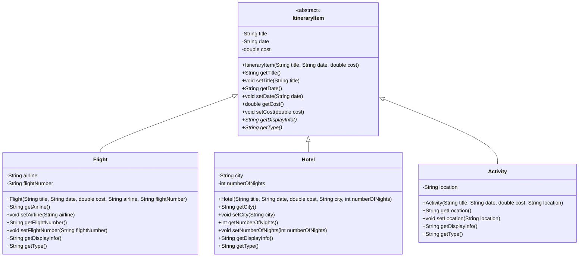
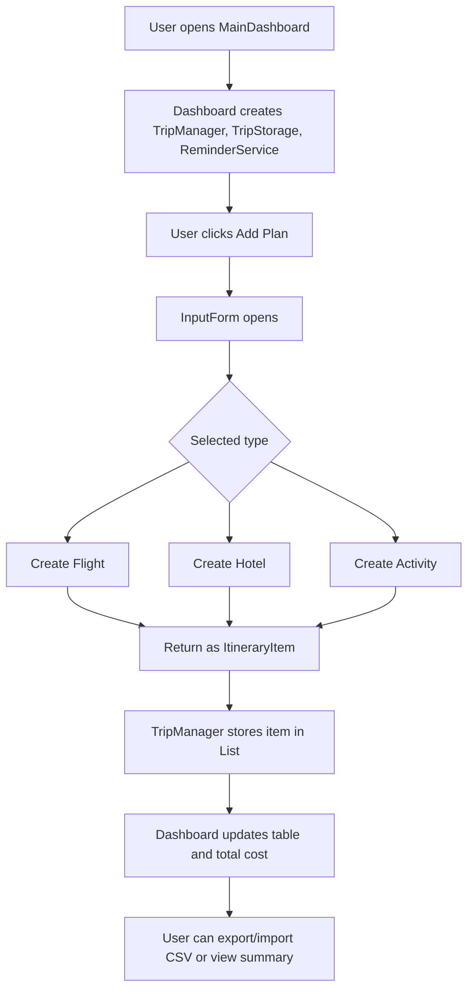

# Trip Planner - OOP Technical Report

## Project Overview

Trip Planner is a Java Swing desktop application for managing a travel itinerary. The user can add travel plans as flights, hotels, or activities, view them in a dashboard table, calculate the total trip budget, receive upcoming-trip reminders, and import/export the itinerary using CSV files.

This project was built for an Object-Oriented Programming university course. The main goal is not only to provide a usable trip planning application, but also to demonstrate the core OOP concepts expected in the course: encapsulation, inheritance, abstraction, polymorphism, and separation of responsibilities between classes.

## Quick Evaluation Summary

| Area | Implementation |
| --- | --- |
| Language | Java |
| UI Framework | Java Swing |
| Look and Feel | FlatLaf dark/light themes |
| Build Tool | Maven, with NetBeans project metadata also included |
| Main Class | `tripplanner.ui.MainDashboard` |
| Data Storage | CSV import/export through `TripStorage` |
| Core OOP Model | Abstract parent class `ItineraryItem` with `Flight`, `Hotel`, and `Activity` subclasses |
| Main OOP Concepts | Encapsulation, inheritance, abstraction, polymorphism, composition |

## How to Run

### Prerequisites

| Requirement | Version |
| --- | --- |
| JDK | 8 or later |
| Maven | 3.8 or later |

The project is configured for Java 8 compatibility in `pom.xml`.

### Run with Maven

```bash
mvn compile
mvn exec:java
```

### Build Runnable JAR

```bash
mvn package
java -jar target/TripPlanner-runnable.jar
```

### Run with NetBeans

1. Open NetBeans.
2. Select `File > Open Project`.
3. Choose the `Trip---Planner` folder.
4. Wait for Maven dependencies to load.
5. Run the project.

Main class:

```text
tripplanner.ui.MainDashboard
```

## Project Structure

```text
Trip---Planner/
|-- pom.xml
|-- build.xml
|-- nbactions.xml
|-- nbproject/
|-- README.md
|-- Project_Summary.md
`-- src/
    `-- tripplanner/
        |-- TripManager.java
        |-- model/
        |   |-- ItineraryItem.java
        |   |-- Flight.java
        |   |-- Hotel.java
        |   `-- Activity.java
        |-- storage/
        |   |-- TripStorage.java
        |   `-- ReminderService.java
        `-- ui/
            |-- MainDashboard.java
            `-- InputForm.java
```

Note: this project uses `src` as the Maven source directory instead of the default `src/main/java`. This is configured in `pom.xml`.

## Main Features

| Feature | Description | Main Classes |
| --- | --- | --- |
| Add itinerary item | User selects Flight, Hotel, or Activity and fills the required fields | `InputForm`, `TripManager`, model classes |
| View itinerary | All plans are displayed in a Swing table | `MainDashboard` |
| Delete item | Selected table row is removed from the itinerary | `MainDashboard`, `TripManager` |
| Show summary | Displays all itinerary items using polymorphic `getDisplayInfo()` calls | `MainDashboard`, `TripManager`, model classes |
| Calculate total cost | Adds the cost of all itinerary items | `TripManager` |
| Import CSV | Reads saved itinerary rows and reconstructs objects | `TripStorage` |
| Export CSV | Saves the current itinerary to a CSV file | `TripStorage` |
| Reminder popup | Checks dates and warns about trips today or within two days | `ReminderService` |
| Theme toggle | Switches between FlatLaf dark and light UI themes | `MainDashboard` |

## OOP Structure Diagram

The main inheritance relationship is in the `tripplanner.model` package. `ItineraryItem` is the abstract parent class. `Flight`, `Hotel`, and `Activity` inherit from it and provide their own implementations of the abstract methods.



## Class Responsibility Report

### `ItineraryItem`

`ItineraryItem` is the abstract base class for all itinerary objects. It stores the fields that are common to every plan:

| Field | Purpose |
| --- | --- |
| `title` | Name or short description of the plan |
| `date` | Date in `yyyy-MM-dd` format |
| `cost` | Item cost |

It also defines two abstract methods:

```java
public abstract String getDisplayInfo();
public abstract String getType();
```

These methods force every child class to provide its own display text and type label.

### `Flight`

`Flight` extends `ItineraryItem` and adds flight-specific information:

| Field | Purpose |
| --- | --- |
| `airline` | Airline company name |
| `flightNumber` | Flight identifier |

Its `getDisplayInfo()` method includes airline and flight number details.

### `Hotel`

`Hotel` extends `ItineraryItem` and adds accommodation-specific information:

| Field | Purpose |
| --- | --- |
| `city` | City where the hotel is located |
| `numberOfNights` | Number of booked nights |

Its `getDisplayInfo()` method includes city and number of nights.

### `Activity`

`Activity` extends `ItineraryItem` and adds activity-specific information:

| Field | Purpose |
| --- | --- |
| `location` | Location of the activity |

Its `getDisplayInfo()` method includes the activity location.

### `TripManager`

`TripManager` is the central in-memory data manager. It stores all itinerary objects in:

```java
private final List<ItineraryItem> items;
```

This is an important OOP design choice. The list uses the parent type `ItineraryItem`, so it can store `Flight`, `Hotel`, and `Activity` objects together.

Main responsibilities:

| Method | Purpose |
| --- | --- |
| `addItem(ItineraryItem item)` | Adds a new plan |
| `removeItem(int index)` | Deletes a plan |
| `updateItem(int index, ItineraryItem newItem)` | Replaces an existing plan |
| `getItems()` | Returns the current item list |
| `setItems(List<ItineraryItem> imported)` | Replaces the list after importing |
| `calculateTotalCost()` | Calculates total budget |
| `getDisplaySummaries()` | Calls each item's polymorphic display method |

### `TripStorage`

`TripStorage` handles file persistence. It saves and loads itinerary data as CSV.

CSV format:

```text
type,title,date,cost,extra1,extra2
Flight,Cairo-London,2024-06-15,850.00,EgyptAir,MS-777
Hotel,Hilton Cairo,2024-06-16,200.00,Cairo,3
Activity,Pyramids Tour,2024-06-17,50.00,Giza,
```

The meaning of `extra1` and `extra2` depends on the item type:

| Type | `extra1` | `extra2` |
| --- | --- | --- |
| `Flight` | Airline | Flight number |
| `Hotel` | City | Number of nights |
| `Activity` | Location | Empty |

### `ReminderService`

`ReminderService` checks the itinerary dates using a Swing `Timer`. It displays a popup if an item is scheduled for today or within the next two days.

It depends on `TripManager`, reads the current list of `ItineraryItem` objects, and uses each item's `getDisplayInfo()` method in the reminder message.

### `InputForm`

`InputForm` is a modal `JDialog` used to create new itinerary items. It uses:

| UI Technique | Purpose |
| --- | --- |
| `JComboBox` | Selects item type |
| `CardLayout` | Shows different input fields for Flight, Hotel, and Activity |
| `JSpinner` with `SpinnerDateModel` | Selects valid dates |
| `JSpinner` with `SpinnerNumberModel` | Selects hotel nights |
| Validation/highlighting | Prevents empty required fields and invalid costs |

After validation, it creates the correct subclass:

```java
new Flight(...)
new Hotel(...)
new Activity(...)
```

The created object is returned as an `ItineraryItem` reference.

### `MainDashboard`

`MainDashboard` is the main application window and entry point. It extends `JFrame` and contains:

| Component | Purpose |
| --- | --- |
| Header | App title and theme toggle |
| Stats cards | Number of plans and total cost |
| Toolbar | Add, delete, summary, import, export buttons |
| Table | Displays itinerary items |
| Footer | Short usage hint |

It connects the UI to the rest of the system by composing:

```java
private final TripManager tripManager;
private final TripStorage tripStorage;
private final ReminderService reminderService;
```

## OOP Concepts Demonstrated

### 1. Encapsulation

Encapsulation is shown by keeping fields private and exposing controlled access through methods.

Example from `ItineraryItem`:

```java
private String title;
private String date;
private double cost;

public String getTitle() { return title; }
public void setTitle(String title) { this.title = title; }
```

The same idea is used in the child classes. For example, `Flight` keeps `airline` and `flightNumber` private, while `Hotel` keeps `city` and `numberOfNights` private.

### 2. Abstraction

`ItineraryItem` is abstract because a generic itinerary item should not be created directly. The application should create a specific item type: `Flight`, `Hotel`, or `Activity`.

The abstract methods:

```java
getDisplayInfo()
getType()
```

define what every itinerary item must be able to do, without forcing the parent class to know the details of every child class.

### 3. Inheritance

Inheritance is implemented through this structure:

```text
ItineraryItem
|-- Flight
|-- Hotel
`-- Activity
```

The child classes reuse the common fields and behavior from `ItineraryItem`, then add their own specialized fields.

Example:

```java
public class Flight extends ItineraryItem {
    private String airline;
    private String flightNumber;
}
```

### 4. Polymorphism

Polymorphism appears when the program stores multiple child objects as the parent type:

```java
private final List<ItineraryItem> items;
```

The same method call:

```java
item.getDisplayInfo();
```

produces different output depending on whether the actual object is a `Flight`, `Hotel`, or `Activity`.

This is most clearly shown in `TripManager.getDisplaySummaries()`.

### 5. Composition

The dashboard uses composition by owning service objects instead of inheriting from them:

```java
private final TripManager tripManager;
private final TripStorage tripStorage;
private final ReminderService reminderService;
```

This keeps responsibilities separated:

| Class | Responsibility |
| --- | --- |
| `MainDashboard` | User interface |
| `TripManager` | In-memory itinerary management |
| `TripStorage` | CSV persistence |
| `ReminderService` | Reminder checking |

## Application Flow



## Package Design

| Package | Purpose |
| --- | --- |
| `tripplanner.model` | OOP domain model and inheritance hierarchy |
| `tripplanner.storage` | Persistence and reminder services |
| `tripplanner.ui` | Swing user interface |
| `tripplanner` | Main manager class shared by UI and services |

This separation makes the code easier to evaluate because the domain model, UI, and storage logic are not all placed in one file.

## Dependencies

| Dependency | Version | Purpose |
| --- | --- | --- |
| FlatLaf | 3.4.1 | Modern Swing dark/light look and feel |
| Gson | 2.10.1 | Included dependency for JSON support, although the current implemented persistence is CSV |
| Maven Compiler Plugin | 3.11.0 | Compiles the Java source |
| Exec Maven Plugin | 3.1.0 | Runs the Swing main class from Maven |
| Maven Shade Plugin | 3.5.1 | Builds a runnable JAR with dependencies |

## Testing and Validation Notes

The project includes runtime validation in the input form:

| Validation | Behavior |
| --- | --- |
| Empty title | Field is highlighted and save is blocked |
| Empty cost | Field is highlighted and save is blocked |
| Negative or non-numeric cost | Error dialog is shown |
| Empty airline/flight number | Flight cannot be saved |
| Empty hotel city | Hotel cannot be saved |
| Empty activity location | Activity cannot be saved |
| Date input | Controlled by date spinner, so manual invalid date text is avoided |
| Hotel nights | Controlled by spinner with minimum value of 1 |

Suggested manual test cases for grading:

1. Add one `Flight`, one `Hotel`, and one `Activity`.
2. Open the summary and confirm each item has different display formatting.
3. Confirm the total cost equals the sum of all item costs.
4. Export the itinerary to CSV.
5. Import the same CSV and confirm the table is rebuilt correctly.
6. Try saving an item with an empty title or invalid cost and confirm validation appears.
7. Toggle between dark and light mode.

## TA-Focused OOP Evaluation Checklist

| Requirement | Where to Check |
| --- | --- |
| Abstract class used correctly | `src/tripplanner/model/ItineraryItem.java` |
| Inheritance from parent class | `Flight`, `Hotel`, and `Activity` extend `ItineraryItem` |
| Private fields and getters/setters | All model classes |
| Overridden methods | `getDisplayInfo()` and `getType()` in every child class |
| Polymorphic collection | `List<ItineraryItem>` in `TripManager` |
| Polymorphic method call | `TripManager.getDisplaySummaries()` |
| GUI integration | `MainDashboard` and `InputForm` |
| File handling | `TripStorage.saveToCSV()` and `TripStorage.loadFromCSV()` |
| Separation of concerns | Different packages for model, storage, UI, and manager |

## Known Limitations

| Limitation | Explanation |
| --- | --- |
| CSV parser is simple | It handles basic comma escaping but is not a complete RFC-compliant CSV parser |
| No database | Data is stored only when the user exports CSV |
| No automated tests included | Current validation is manual through the GUI |
| Gson is present but not used | The current storage implementation uses CSV |

## Conclusion

Trip Planner demonstrates a clear OOP design suitable for a university course project. The model layer uses an abstract parent class with three concrete subclasses, the manager stores objects polymorphically through the parent type, and the UI creates and displays those objects without needing separate lists for each type. The code also separates user interface, business logic, storage, and reminder behavior into different classes, making the project straightforward to inspect and grade.
